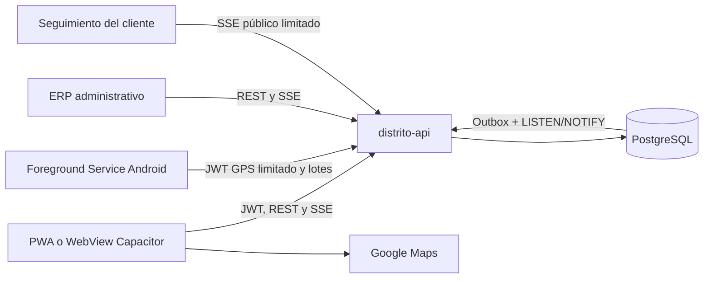

# Distrito BG Delivery

Aplicación operativa para los domiciliarios de Distrito BG. Se entrega como PWA
responsive y como proyecto Android/Capacitor con seguimiento GPS mediante un
servicio en primer plano. Usa la misma autenticación, API y base PostgreSQL del
ERP; no calcula precios, cupos, permisos, estados ni geocercas por su cuenta.

## Alcance implementado

- Login con usuario, correo o documento, recuperación de contraseña, renovación
  de sesión y administración de hasta tres dispositivos desde Perfil.
- Turno explícito por domiciliario: iniciar, mantener presencia mediante heartbeat,
  transferir el dispositivo GPS oficial y finalizar.
- Capacidad configurable por usuario y capacidad predeterminada central. La API
  cuenta pedidos reservados, aceptados y en reparto antes de autorizar otro.
- Lista de pedidos disponibles con actualización SSE, alerta sonora, voz y
  vibración; el detalle sensible solo se entrega al responsable del pedido.
- Aceptación atómica e idempotente. Dos domiciliarios no pueden tomar la misma
  orden y dos solicitudes simultáneas no pueden superar el cupo del conductor.
- Recorrido sobre Google Maps, navegación externa, datos de contacto, productos,
  observaciones, pago y cambio una vez autorizada la asignación.
- GPS en modos `OFF`, `FREE` y `DELIVERY`, envío por lotes, cola offline acotada,
  deduplicación y cálculo de distancia física en el servidor.
- Finalización con confirmación del cliente, observaciones, calificación y foto
  opcional. La API valida vigencia, precisión y radio de llegada del último GPS.
- Historial, estadísticas, perfil, vehículo, documentos, Push y diseño adaptable
  para móvil, tableta y escritorio.
- Recuperación ante errores sin pantalla negra: permite volver a Pedidos, recargar
  o cerrar sesión de forma explícita.

## Arquitectura y fuente única de verdad



Reglas que no deben duplicarse:

| Regla | Fuente autoritativa |
| --- | --- |
| Pedido, responsable, versión y destino | `pedidos_app_orders` |
| Transiciones logísticas | `distrito-api/src/delivery-domain.js` |
| Operaciones transaccionales | `distrito-api/src/delivery-order-service.js` |
| Validación e ingestión GPS | `distrito-api/src/delivery-location-service.js` |
| Cupo por domiciliario | `pedidos_app_delivery_profiles.max_active_orders` |
| Intervalos, tolerancias y radio | `pedidos_app_settings` |
| Presentación de estados | `distrito-shared/src/orderFlow.js` |
| Difusión multiinstancia | `pedidos_app_domain_events` + `LISTEN/NOTIFY` |

La interfaz puede orientar al usuario, pero el servidor vuelve a validar identidad,
rol, turno, dispositivo, cupo, versión del pedido, transición y geocerca dentro de
una transacción PostgreSQL.

## Estados y flujo operativo

El ERP conserva dos dimensiones relacionadas:

| Momento | Estado comercial | Estado de entrega | Acción autorizada |
| --- | --- | --- | --- |
| Cocina trabajando | `Preparando` | `Pendiente` | Admin/cocina |
| Disponible para reparto | `Listo` | `Pendiente` | Domiciliario acepta o Admin reserva |
| Conductor comprometido | `Listo` | `Aceptado` | Responsable inicia recorrido |
| Pedido salió del local | `En camino` | `En camino` | Responsable comparte GPS |
| Cliente lo recibió | `Entregado` | `Entregado` | Finalización validada |
| Flujo abortado | `Cancelado` | `Cancelado` | Admin con regla de negocio |

`Recogido` se normaliza como compatibilidad de datos anteriores. Los pedidos
nuevos siguen `Pendiente → Aceptado → En camino → Entregado`. Ninguna ruta genérica
del ERP puede forzar `En camino` o `Entregado`; esas transiciones pasan por el
servicio de dominio.

La asignación manual de Admin reserva capacidad pero no suplanta la aceptación
operativa del domiciliario. Toda operación crítica usa `Idempotency-Key`; repetir
la misma solicitud devuelve el resultado previo y reutilizar la clave con otros
datos produce conflicto.

## Turnos, presencia y dispositivos

Una sesión autenticada y un turno son conceptos distintos:

1. El login crea una sesión normal del ERP.
2. **Iniciar turno** vincula un `X-Device-Id` como emisor GPS oficial.
3. El heartbeat indica presencia y estado del GPS.
4. Solo ese dispositivo puede subir posiciones o finalizar el turno.
5. Transferir el turno cambia el dispositivo oficial y queda auditado.
6. Un turno con pedidos comprometidos no puede cerrarse normalmente.
7. Admin puede forzar el cierre con permiso `Domicilios:forzar_turno` y motivo.

El mapa administrativo considera conectado a un domiciliario por turno activo y
heartbeat reciente, no por la antigüedad del último punto GPS. Así un conductor
quieto continúa conectado y un teléfono que dejó de reportar aparece desconectado.

## GPS y geocerca

Los modos se aplican desde la configuración central:

- `OFF`: turno cerrado; no se recopila ubicación.
- `FREE`: turno activo sin entrega en recorrido; frecuencia reducida.
- `DELIVERY`: al menos un pedido `En camino`; frecuencia alta.

Cada posición contiene identificador del cliente, dispositivo, coordenadas,
precisión y hora de captura. La API rechaza coordenadas fuera de rango, fechas muy
antiguas o futuras, lotes excesivos y dispositivos que no controlan el turno. Los
puntos repetidos se ignoran y los saltos físicamente imposibles no aumentan los
kilómetros.

Para entregar un destino exacto, el servidor exige:

- posición posterior al inicio del recorrido;
- antigüedad menor que `gps_max_age_seconds`;
- precisión igual o mejor que `gps_max_accuracy_meters`;
- distancia dentro de `delivery_completion_radius_meters`.

Si la ubicación del cliente es excepcional, Admin puede crear una autorización de
geocerca de un solo uso con permiso `Domicilios:override_geocerca` y un motivo
auditable. La evidencia fotográfica se valida por MIME, firma y tamaño, y se guarda
separada del JSON del pedido.

## Android nativo y PWA

El proyecto Android está en `android/` y usa `DeliveryLocationService`:

- `Foreground Service` con notificación persistente y reinicio `START_STICKY`;
- Fused Location Provider en frecuencias `FREE` y `DELIVERY`;
- cola SQLite para pérdida de red y reenvío por lotes;
- token GPS limitado almacenado en `EncryptedSharedPreferences` respaldadas por
  Android Keystore;
- detección de GPS apagado, permisos revocados y recuperación tras cerrar el
  proceso visual.

El JWT normal nunca se entrega al servicio. La PWA autenticada solicita un código
de un solo uso, válido por 90 segundos; el plugin lo pasa al servicio Android, que
lo intercambia directamente por un token de seguimiento de alcance limitado. El
token final no vuelve al JavaScript.

La PWA web conserva el mismo flujo y una cola IndexedDB, pero Android/iOS pueden
suspender JavaScript en segundo plano. Por eso el seguimiento continuo con pantalla
apagada solo está garantizado por la variante Android nativa. Ningún software puede
reportar ubicación si el teléfono está apagado, sin batería, sin permiso o con el
GPS deshabilitado.

## Tiempo real

Las escrituras de negocio y su evento se confirman en la misma transacción. Cada
instancia recorre incrementalmente el log de eventos compartido; `LISTEN/NOTIFY`
reduce la latencia cuando el proveedor lo permite y el sondeo incremental conserva
la propagación cuando se usa un pooler que no reenvía notificaciones. SSE envía
identificadores estables y el cliente conserva `Last-Event-ID`; al reconectar
reproduce los eventos pendientes y consulta de nuevo el estado autoritativo.

Los intervalos de reconexión inicial y máximo se administran desde Configuración.
SSE acelera la interfaz, pero nunca sustituye la consulta REST ni se usa como fuente
de verdad.

## API principal

Todas las rutas parten de `/api/pedidos`.

| Método y ruta | Función |
| --- | --- |
| `GET /delivery/me` | Perfil, turno, capacidad y configuración operativa |
| `POST /delivery/shift/start` | Inicia o reanuda turno |
| `POST /delivery/shift/heartbeat` | Actualiza presencia y estado GPS |
| `POST /delivery/shift/transfer-device` | Transfiere el dispositivo oficial |
| `POST /delivery/shift/end` | Finaliza turno sin compromisos |
| `GET /delivery/orders/available` | Lista mínima de pedidos disponibles/reservados |
| `GET /delivery/orders/current` | Pedidos comprometidos y capacidad |
| `GET /delivery/orders/:id` | Detalle solo para el responsable |
| `POST /delivery/orders/:id/accept` | Acepta atómicamente |
| `POST /delivery/orders/:id/pickup` | Inicia el recorrido (`En camino`) |
| `POST /delivery/orders/:id/complete` | Finaliza con geocerca |
| `POST /delivery/location/batch` | Lote GPS desde la PWA |
| `POST /delivery/native/bootstrap` | Crea código nativo de un solo uso |
| `POST /delivery/native/exchange` | Intercambia código dentro del plugin |
| `POST /delivery/native/location/batch` | Lote GPS del servicio Android |
| `GET /delivery/history` | Historial personal |
| `GET /delivery/stats` | Indicadores personales |
| `GET /realtime/stream` | SSE autenticado con recuperación |

Admin complementa el flujo mediante `/admin/delivery/overview`, asignación,
finalización forzada de turno, excepción de geocerca y lectura autorizada de
evidencias. El cliente solo recibe datos públicos limitados durante el seguimiento.

## Configuración central

En **Admin → Configuración → Domicilios** se administran:

- coordenadas/dirección de la cocina y radio de finalización;
- intervalo GPS en entrega y libre;
- intervalo de heartbeat y umbral de desconexión;
- antigüedad y precisión GPS máximas;
- límite de cola offline y capacidad predeterminada;
- reconexión SSE inicial y máxima;
- identidad visual, idioma, voz y alertas.

Los campos tienen límites en API y restricciones `CHECK` en PostgreSQL. El cupo
individual configurado en Usuarios prevalece sobre el valor predeterminado.

## Desarrollo local

Desde la raíz del repositorio:

```powershell
.\start-local.ps1
```

O únicamente Delivery:

```powershell
Set-Location .\distrito-delivery
npm ci
Copy-Item .env.example .env
npm run dev
```

La PWA abre en `http://localhost:5175`. `config/api-environments.json` es la fuente
única de las URLs: navegador local usa `auto`, Android de desarrollo usa el host
del emulador y cualquier build de producción queda bloqueado a
`https://api.distritobg.app`. Las credenciales reales continúan en archivos `.env`
ignorados o en el gestor de secretos; nunca se copian al README.

La interfaz puede abrirse por IP LAN, pero GPS, cámara, Push e instalación PWA
requieren HTTPS salvo en `localhost`. Para una prueba real desde otro dispositivo
usa el dominio HTTPS o un proxy con certificado válido.

## Compilar PWA y Android

```powershell
Set-Location .\distrito-delivery

# Desarrollo Android: API del emulador http://10.0.2.2:3001 y APK debug.
npm run android:development

# Producción: API HTTPS fija, comprobación de assets, tests, APK y AAB firmados.
npm run android:release
```

La configuración Release exige por defecto
`%USERPROFILE%\.distritobg\android-release-signing.properties`; también se puede
indicar otro archivo mediante `DISTRITO_BG_SIGNING_PROPERTIES`. La clave y sus
contraseñas nunca están en el proyecto ni se empaquetan en la aplicación.

Resultados:

- `android/app/build/outputs/apk/debug/app-debug.apk` para desarrollo;
- `android/app/build/outputs/apk/release/app-release.apk` para instalación directa;
- `android/app/build/outputs/bundle/release/app-release.aab` para Google Play.

El Release establece `usesCleartextTraffic=false`, `allowMixedContent=false`,
rechaza redirecciones en el servicio GPS y valida nuevamente en Java que la API sea
`https://api.distritobg.app/api/pedidos`.

Para publicar la PWA, sirve `dist/` con fallback SPA a `index.html`, configura DNS
y TLS para `delivery.distritobg.app`, incluye el origen en CORS y prueba login,
refresh, SSE, GPS, cámara, Push e instalación en dispositivos reales.

## Operación, retención y diagnóstico

- `/api/pedidos/health` informa PostgreSQL, outbox, clientes SSE, GPS reciente y
  turnos activos sin exponer secretos.
- Los logs son JSON e incluyen `request_id`, usuario, conductor, pedido y dispositivo;
  no incluyen tokens ni el cuerpo de las solicitudes.
- `npm run db:prune-delivery` elimina por política los puntos y eventos antiguos.
  Los avisos GPS del log se conservan un día y los eventos de negocio publicados,
  treinta días. Después actualiza estadísticas. Prográmalo como tarea recurrente.
- Si el servicio pierde autorización, conserva y acota la cola GPS; al volver a
  abrir la app se renueva el bootstrap nativo.

## Validación obligatoria

```powershell
Set-Location .\distrito-api
npm run migrate
npm run check
npm test

Set-Location ..\distrito-delivery
npm run android:release
```

Las pruebas cubren transiciones, geocerca, aceptación concurrente, capacidad,
reserva administrativa, idempotencia y deduplicación GPS. Antes de producción se
debe completar además una corrida en dispositivos reales con pantalla apagada,
pérdida de red, GPS deshabilitado, transferencia de dispositivo y recuperación SSE.

El estado exacto del Release, la firma y la compatibilidad actual de Render están
en [`../distrito-docs/ANDROID_RELEASE_2026-08-09.md`](../distrito-docs/ANDROID_RELEASE_2026-08-09.md).
