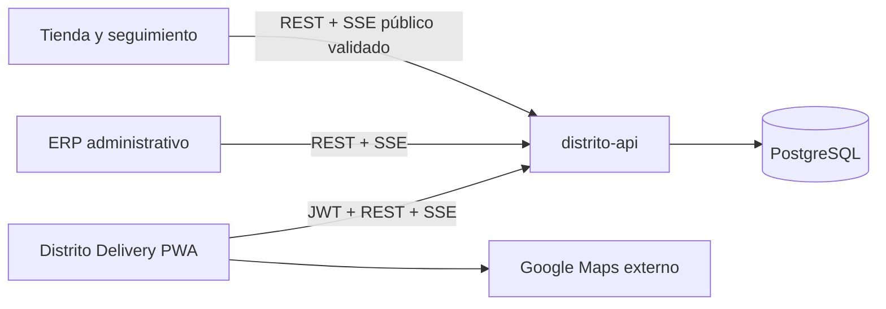

# Distrito BG Delivery

PWA responsive para la operación de domiciliarios de Distrito BG. Es un cliente
independiente, pero no crea otra fuente de datos: usa el mismo JWT, la misma API y
la misma base PostgreSQL del ERP.

## Funciones implementadas

- Inicio de sesión por usuario, correo o documento, opción de recordar sesión y
  recuperación de contraseña.
- Máximo de tres dispositivos simultáneos y cierre remoto de sesiones desde Perfil.
- Los roles Domiciliario/Repartidor no caducan por falta de clics mientras esperan
  pedidos: la PWA renueva el token cada cinco minutos y la API solo finaliza estas
  sesiones por cierre manual, revocación o expiración absoluta.
- Pedidos disponibles y asignados sincronizados por Server-Sent Events (SSE), sin
  recargar la página.
- Aceptación transaccional: el primer domiciliario que acepta toma el pedido y este
  desaparece de los demás dispositivos.
- Cada perfil admite entre uno y cinco pedidos simultáneos, según el cupo definido
  por el administrador en Usuarios. La API bloquea el perfil durante la aceptación
  para impedir que solicitudes concurrentes superen ese límite.
- Detalle de cliente, productos, observaciones, pago, cambio, teléfono, WhatsApp,
  navegación externa y mapa Google embebido con cocina, destino, motocicleta y
  recorrido GPS ya informado.
- Al aceptar un pedido `Listo`, la transacción lo asigna, cambia inmediatamente a
  `En camino` y abre su detalle para activar el GPS. La entrega termina en
  `Entregado`; se conservan las marcas de aceptación, salida y duración.
- GPS automático cada siete segundos mientras existan pedidos `En camino`; una
  sola lectura se registra en todos los seguimientos activos del domiciliario y
  deja de compartirse cuando termina el último.
- La acción **Finalizar entrega** aparece cuando el GPS vigente y con precisión
  suficiente entra en el radio configurado (150 m por defecto, ajustable entre 50
  y 500 m). La API repite esa validación para impedir que el navegador la omita.
  Los pedidos históricos sin coordenadas conservan confirmación manual controlada.
- Entrega con confirmación obligatoria, observaciones, calificación y fotografía
  opcionales. La fotografía se redimensiona y comprime antes del envío.
- Historial, indicadores personales, gráficas diarias y por hora.
- Perfil personal, vehículo, placa, documentos y cambio de contraseña.
- Instalación PWA, modo offline informativo, notificaciones web push y alerta de
  pedido disponible con sonido, vibración y aviso visual en cualquier módulo.
- Al entrar después del login aparece la preparación del dispositivo: instalar la
  PWA, conceder GPS y desbloquear el sonido. Puede abrirse nuevamente desde
  **Configurar dispositivo**.
- Diseño oscuro `#D4A017`, navegación inferior móvil, barra lateral en escritorio,
  controles táctiles y soporte de `prefers-reduced-motion`.
- Una sola región vertical usa `100dvh`, inercia táctil y espacio para la navegación
  inferior; un límite de errores conserva la sesión y ofrece recarga en lugar de
  dejar una pantalla negra.

## Fuente única de verdad



La PWA nunca escribe en PostgreSQL directamente. Todos los cambios pasan por la
API, que valida el rol `Domiciliario`, la sesión activa y la transición permitida.
Los estados de reparto viven en `delivery_status`; el estado comercial existente
del ERP se sincroniza cuando el pedido sale, se cancela o se entrega.

## Desarrollo local

```powershell
npm ci
Copy-Item .env.example .env
npm run dev
```

La aplicación abre en `http://localhost:5175`. Con `VITE_API_URL=auto` resuelve la
API usando la misma IP/hostname y el puerto `VITE_API_PORT` (predeterminado `3001`).
La clave y el Map ID no se duplican: durante el build se leen de
`../distrito-web/.env`, que continúa fuera del control de versiones. En CI también
pueden inyectarse como `VITE_GOOGLE_MAPS_API_KEY` y `VITE_GOOGLE_MAPS_MAP_ID`.

Desde la raíz de DistritoBG también se pueden iniciar los cuatro servicios:

```powershell
.\start-local.ps1
```

El script compila la PWA y la expone en `0.0.0.0:5175`; imprime las direcciones LAN
y pública detectadas. Para detener solo esos procesos usa `.\stop-local.ps1`.

> La geolocalización, instalación completa y push requieren contexto seguro en la
> mayoría de navegadores. `localhost` funciona para desarrollo; al entrar mediante
> una IP LAN usa HTTPS (proxy/túnel/certificado local) para probar GPS y PWA.

Abrir `http://192.168.x.x:5175` sirve para validar la interfaz, pero el navegador no
entregará coordenadas en ese origen ni permitirá finalizar pedidos geolocalizados.
Para una prueba operativa usa
`https://delivery.distritobg.app` (o un origen local HTTPS válido), concede el
permiso de ubicación y mantén Delivery abierta o instalada.
Los navegadores no garantizan GPS en segundo plano como una aplicación nativa; la
PWA solicita bloqueo de pantalla durante el reparto y reanuda el seguimiento al
volver a estar visible.

## API utilizada

Todas las rutas parten de `/api/pedidos`.

| Ruta | Función |
| --- | --- |
| `POST /admin/login` | Login compartido del ERP |
| `POST /admin/refresh-token` | Renovar el token corto |
| `GET /delivery/me` | Identidad y perfil operativo |
| `GET /delivery/orders/available` | Pedidos `Listo` disponibles/asignados |
| `GET /delivery/orders/current` | Entrega activa |
| `GET /delivery/orders/:id` | Detalle autorizado |
| `POST /delivery/orders/:id/accept` | Aceptación atómica |
| `POST /delivery/orders/:id/pickup` | Compatibilidad con pedidos aceptados bajo el flujo anterior |
| `POST /delivery/orders/:id/location` | Muestra GPS y distancia autorizada a destino |
| `POST /delivery/orders/:id/complete` | Confirmar entrega dentro de la geocerca |
| `GET /delivery/history` | Historial personal |
| `GET /delivery/stats` | Indicadores personales |
| `PUT /delivery/profile` | Datos y credenciales del domiciliario |
| `POST /delivery/push/subscribe` | Push asociado al usuario |
| `GET /realtime/stream` | Canal SSE autenticado |

## PWA y notificaciones

- Android/Chrome: menú “Instalar aplicación” o el aviso interno cuando el navegador
  emita `beforeinstallprompt`.
- iPhone/iPad: Safari → Compartir → “Agregar a pantalla de inicio”. Las
  notificaciones web funcionan en versiones compatibles una vez instalada la PWA.
- El service worker conserva el shell básico y muestra una vista informativa sin
  conexión. Pedidos, aceptación y entrega requieren red para evitar inconsistencias.
- El navegador exige una interacción para habilitar audio. El login lo activa y,
  si la sesión fue restaurada, aparece **Activar sonido** en la barra. Al ingresar
  un pedido nuevo se reproducen tres tonos, vibra el dispositivo compatible y se
  muestra un aviso de nueve segundos con acceso a la cola.
- Web Push continúa siendo el mecanismo para recibir avisos cuando la PWA está en
  segundo plano o suspendida; el sonido interno cubre la aplicación abierta.

## Publicación en `delivery.distritobg.app`

1. Compilar con `npm run build`.
2. Publicar `dist/` con reescritura SPA hacia `index.html`.
3. Configurar `VITE_API_URL` con el origen HTTPS real de la API.
4. Crear DNS/SSL para `delivery.distritobg.app`.
5. Incluir el origen en `CORS_ORIGINS` de la API (también existe en la lista segura).
6. Validar login, refresh, SSE, permiso GPS, cámara, push e instalación desde un
   dispositivo real.

## Decisiones de rendimiento y privacidad

- La ubicación solo se almacena durante una entrega `En camino` y el seguimiento
  público solo la devuelve durante ese estado.
- Las listas usan índices parciales por estado/responsable agregados en
  `006_delivery_operations.sql`; `007_delivery_guards_and_retention.sql` impide dos
  entregas activas por domiciliario y acelera la política de retención GPS.
- La ruta de navegación se delega a Google Maps mediante URL. El detalle reutiliza
  `LiveDeliveryMap` para visualizar el recorrido registrado; no mantiene otra
  implementación ni decide la llegada en el frontend.
- SSE reduce consultas repetidas. El sondeo de 20 segundos del mapa administrativo
  es una red de seguridad si el canal se reconecta.
- La navegación cliente usa un router interno limitado a rutas absolutas conocidas;
  no incorpora los modos SSR/RSC que no necesita esta PWA y `npm audit --omit=dev`
  queda sin vulnerabilidades conocidas en la validación actual.
- Para varias instancias de API, el siguiente paso de infraestructura es propagar
  eventos mediante PostgreSQL `LISTEN/NOTIFY` o Redis; el hub actual es por proceso.
- La fotografía opcional tiene límite de 2 MB comprimidos. Para alto volumen se
  recomienda mover evidencias a almacenamiento de objetos y guardar solo su URL.

## Validación

```powershell
npm run build

cd ..\distrito-api
npm run migrate
npm run check
npm test
```

No agregues lógica de precios, permisos o estados críticos al navegador. Tampoco
dupliques tablas: amplía la migración siguiente y expón el cambio desde la API.
